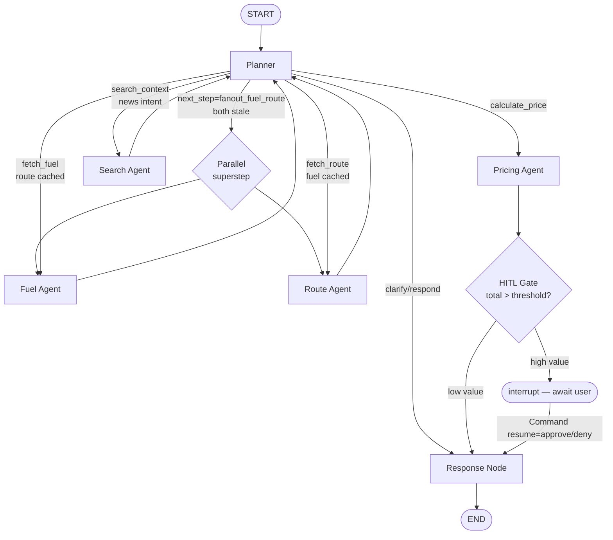

# Express Dynamic Surcharge Orchestrator

> Agentic AI that calculates fuel surcharges for Express logistics in
> Bangkok Metro by reasoning over live diesel prices, route data, and
> internal rate tables — visibly and explainably.

**Course:** MADT7204 — Generative AI for Business
**Submission:** v1.0 (final)


## Project Overview

The Express Dynamic Surcharge Orchestrator is a multi-agent AI product
that helps Express logistics operators in Thailand's Bangkok Metro
derive accurate, explainable fuel-driven surcharge recommendations.
The agent reasons over EPPO diesel B7 prices, Google Maps route data,
and a simulated Express rate table to compute surcharge percentage and
final amount per shipment, with a fully visible reasoning trace —
every LLM call, tool invocation, and routing decision is auditable.

Three shipping types (Bounce, Retail Standard, Retail Fast), three
Bangkok Metro zones (`central-1`, `central-2`, `central-3` — internal
IDs), and a configurable diesel baseline drive a deterministic
surcharge formula (`calculate_surcharge`). The LLM's role is intent
classification, narration, and conditional routing — never numerical
derivation. This split is what makes the system *agentic* (visible
reasoning) without sacrificing accuracy.

## Team

| Role | Student ID | Name |
|------|-----------|------|
| **Tech Lead (IT Lead)** | 6810424009 | Panjapol Ampornratana |
| Management Member | 6810424004 | Jirapa Panich |
| Management Member | 6810424008 | Phanitphan Eiamnon |
| Management Member | 6810424012 | Tanakrid Burutchat |
| Management Member | 6810424020 | Phatthakan Phatthanuwat |

The IT Lead owns agent architecture, tool design, integration, and
technical grading deliverables.

## Problem Statement

Diesel prices in Thailand fluctuate weekly. Express's surcharge tariffs
must adjust to keep pace with fuel volatility without overcharging
customers or eroding margin. Manual recompute by ops teams is slow,
error-prone, and opaque to customers asking "why this number?".

The orchestrator solves this by deriving surcharge programmatically
from live data and presenting the *reasoning* alongside the answer:
base rate, fuel delta, traffic adjustment, cap/floor, and any
high-value approval gating — every step explainable.

## Agent Design

The system is a five-node LangGraph multi-agent graph plus optional
parallel fan-out, an HITL approval gate, and a Tavily-backed Search
Agent. The Planner classifies intent and routes; specialists fetch
data and compute; the Response Node renders prose + breakdown.



Key design decisions:

- **Cache-aware planner**: follow-ups reuse fuel/route data without
  re-calling tools (LangGraph SQLite checkpointer). On follow-ups the
  planner short-circuits to `calculate_price` directly.
- **Parallel fan-out (ORCH-07)**: when both fuel and route are stale
  on a fresh thread, the planner emits a sentinel that the
  conditional edge translates to a list of two destination nodes —
  same-superstep parallel execution. Trace timestamps overlap by
  &lt; 1s, visible evidence of concurrent execution.
- **HITL approval gate (ORCH-09)**: between Pricing and Response,
  a tiny gate node calls `langgraph.types.interrupt()` when total
  &gt; `HITL_TOTAL_THB_THRESHOLD` (default 500 THB; override via env).
  The chat handler emits a sixth SSE event `approval_required`,
  and the frontend renders Approve/Deny buttons. Resume happens via
  a follow-up `POST /api/chat` with `{thread_id, approve}`.
- **Search Agent (TOOL-05)**: news/market/trend questions route
  through a Tavily-backed node that populates `state.search_context`
  with a 1–2 sentence summary + ranked sources. The Response Node
  prepends a "Market context: …" line above the prose answer.
  Search NEVER feeds the deterministic surcharge formula.

Full topology, conditional routing table, and SSE event vocabulary
are documented in [docs/architecture.md](docs/architecture.md).

## Data Sources

See [docs/data-sources.md](docs/data-sources.md) for full provenance,
refresh cadence, and assumptions.

- **EPPO diesel B7 historical prices** (real, public): fetched daily
  via `data/scripts/fetch_fuel_prices.py`; multi-level fallback chain
  (live API → cached CSV → hardcoded baseline).
- **Simulated Express rate table** (transparent assumptions): zone
  multipliers 1.0/1.25/1.55, 3 ship types × 3 zones × multiple weight
  tiers, base-rate range 50–698 THB. Generated by
  `data/scripts/generate_rate_table.py`.
- **Google Maps Directions API**: distance, duration, traffic for
  Bangkok Metro provinces; 15-minute TTL cache.
- **Tavily Search API** (news topic): 30-minute TTL cache; gated by
  news/trend intent — standard surcharge queries do NOT trigger search.

## Setup Instructions

Requirements:
- Python 3.11+
- Node.js 18+
- API keys: Google AI Studio (Gemini), Google Maps, Tavily, Langfuse
  Cloud (free tier)

Install + run:

```bash
# 1. Python venv + backend deps
python3.11 -m venv .venv
source .venv/bin/activate
pip install -r requirements.txt

# 2. Environment variables
cp .env.example .env
# Edit .env, fill in API keys (placeholders documented per key)

# 3. Seed the rate-table SQLite DB
python data/scripts/seed_database.py

# 4. (Optional) Refresh fuel price history
python data/scripts/fetch_fuel_prices.py

# 5. Run backend (uvicorn @ port 8000)
uvicorn backend.api.main:app --port 8000 --reload

# 6. In another shell — frontend
cd frontend
npm install
npm run dev   # http://localhost:3000

# 7. Run tests
pytest backend/tests/                # backend
cd frontend && npm test              # frontend unit
cd frontend && npm run test:e2e      # frontend e2e (Playwright)
```

### Demo prompts

Try these in the chat to exercise the full agent topology:

1. `Calculate surcharge for 15kg bounce shipment from Bangkok to Nonthaburi`
   — fresh-thread query, exercises **parallel fan-out** (Fuel + Route in
   same superstep).
2. `What about Retail Fast?` (after #1) — exercises **cache-aware
   skip** (no Fuel/Route re-fetch).
3. `What's driving diesel prices this week?` — exercises **Search
   Agent** + Tavily (Market context: line above the prose answer).
4. `Calculate surcharge for 200kg retail_fast from Bangkok to a
   central-3 destination` — exercises **HITL approval gate** (total
   &gt; 500 THB threshold; ApprovalCard renders Approve/Deny).

## AI Tools Used

Per the AI/Vibe-Coding 15% rubric:

- **Claude Code (Anthropic)** — primary development environment.
  Used for architecture design, multi-file refactors, test scaffolding,
  and documentation generation. The `/gsd:` workflow commands
  (`research-phase`, `plan-phase`, `execute-phase`) drove the entire
  Phase 1–5 cycle and are versioned alongside this repo at
  `.claude/get-shit-done/`.
- **Claude Agent SDK** — informs the in-product agent architecture
  (multi-agent + tool routing patterns).
- **Cursor** — light inline edits during code review.
- **GitHub Copilot** — typing acceleration for repetitive Pydantic
  models and test fixtures.

Each tool's contribution is auditable via the commit log
(descriptive messages per the Git Practice 20% rubric).

## Observability

Every LLM call, tool invocation, and routing decision is captured by
Langfuse via a single CallbackHandler attached at the chat handler
boundary. Each chat turn maps to one Langfuse trace named
`chat_turn_{thread_id}_{turn_idx}` (deterministic seed) so user
feedback (thumbs up/down) attaches to the same trace.

A formula-accuracy auto-eval runs after every Pricing Agent invocation:
re-runs the deterministic Phase 1 pure function with the same inputs
and posts a `formula_accuracy` Score (1.0 match / 0.0 divergence).
Visible in the Langfuse dashboard, fire-and-forget so eval failure
never affects the user response.


## Limitations

- **Bangkok Metro only** — central-1/2/3 zones cover Bangkok plus
  Nonthaburi, Pathum Thani, Samut Prakan, Nakhon Pathom, Samut Sakhon,
  and Ayutthaya. Multi-region expansion is V2-02 (deferred).
- **Gemini Flash 15 RPM** — sufficient for demo; not production
  throughput. Free tier limit.
- **Tavily 1000 searches/month** — free tier; demo footprint ~10/run.
- **Simulated rate table** — real Express tariffs are confidential.
  Assumptions are transparent in
  [docs/data-sources.md](docs/data-sources.md).
- **Single demo user** — no auth/OAuth (out of scope; not
  relevant to agent architecture grading).
- **Local reproducibility only** — no production deployment infra
  (Docker/K8s out of scope per CLAUDE.md constraints).

## License

MADT7204 course project. See [LICENSE](LICENSE) if present.

## Demo

A 1–2 minute end-to-end recording is available at
[docs/demo.mp4](docs/demo.mp4). It shows a fresh-thread surcharge
query end-to-end including the parallel trace timestamps and a HITL
approval flow.

Static screenshots:

| View | File |
|------|------|
| Chat with surcharge breakdown for Bangkok Metro shipment | [docs/screenshots/chat-breakdown.png](docs/screenshots/chat-breakdown.png) |
| Reasoning trace mid-stream — fuel and route agents in parallel | [docs/screenshots/trace-parallel.png](docs/screenshots/trace-parallel.png) |
| Dashboard — diesel price (THB/L) and recent surcharges | [docs/screenshots/dashboard.png](docs/screenshots/dashboard.png) |
| Approval required — high-value shipment paused for review | [docs/screenshots/hitl-approval.png](docs/screenshots/hitl-approval.png) |
| Langfuse trace view — every LLM and tool call captured | [docs/screenshots/langfuse-trace.png](docs/screenshots/langfuse-trace.png) |

## Repository Layout

```
backend/         # FastAPI + LangGraph orchestrator
  agent/         # graph.py, nodes/, tools/, prompts/, observability.py
  api/           # main.py, routes/ (chat, conversations, fuel_prices, feedback), sse.py
  tests/         # pytest suite — 280+ tests across all phases
frontend/        # Next.js 15 + React 19 + Tailwind UI
  app/           # Next.js app directory
  components/    # chat/, trace/, dashboard/, sidebar/, shared/
  hooks/         # useChatStream, useConversations, useFuelPrices
  lib/           # api.ts, sse.ts, formatters.ts, constants.ts
  types/         # api.types.ts, agent.types.ts (snake_case mirrored)
data/            # CSVs, SQLite DBs, scripts/
docs/            # architecture.md, data-sources.md, demo.mp4, screenshots/
.planning/       # GSD phase plans, summaries, retrospectives (audit trail)
```

---

*Built for MADT7204 by Panjapol Ampornratana (IT Lead) + team.*
