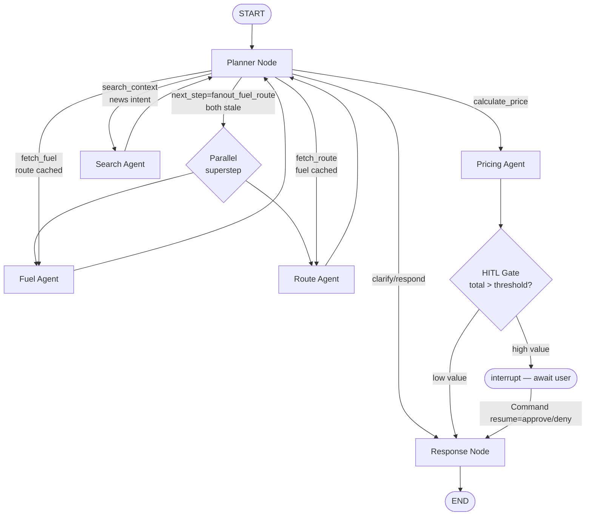

# Architecture Document

## Express Dynamic Surcharge Orchestrator

### Overview

This system is an **Agentic AI product** that dynamically calculates fuel surcharges for Express logistics operations in Thailand's Bangkok Metro. The agent reasons over live fuel prices, route data, and internal rate tables to produce surcharge recommendations — it is the core decision-making product, not a feature on a dashboard.

---

## System Architecture

```
┌─────────────────────────────────────────────────────────────────────┐
│                        SYSTEM OVERVIEW                              │
│                                                                     │
│  ┌──────────┐    SSE / REST    ┌───────────────────────────────┐   │
│  │ Next.js  │◄────────────────►│  FastAPI Backend              │   │
│  │ Frontend │                  │                               │   │
│  │          │                  │  ┌─────────────────────────┐  │   │
│  │ - Chat   │                  │  │  LangGraph Orchestrator │  │   │
│  │ - Trace  │                  │  │                         │  │   │
│  │ - Charts │                  │  │  Planner ──► Fuel Agent │  │   │
│  │ - Feedback│                 │  │          ──► Route Agent│  │   │
│  └──────────┘                  │  │          ──► Price Agent│  │   │
│                                │  └────────┬────────────────┘  │   │
│                                │           │                   │   │
│                                │  ┌────────▼────────┐          │   │
│                                │  │  SQLite Memory  │          │   │
│                                │  │  (Checkpointer) │          │   │
│                                │  └─────────────────┘          │   │
│                                └───────────┬───────────────────┘   │
│                                            │                       │
│          ┌─────────────────────────────────┼────────────────┐      │
│          │         EXTERNAL SERVICES       │                │      │
│          │                                 │                │      │
│          │  ┌──────────┐  ┌────────────┐   ▼                │      │
│          │  │ EPPO /   │  │ Google     │  ┌─────────────┐  │      │
│          │  │ PTT API  │  │ Maps API   │  │  Langfuse   │  │      │
│          │  └──────────┘  └────────────┘  │  (Tracing)  │  │      │
│          │                                └─────────────┘  │      │
│          │  ┌──────────┐  ┌────────────┐                   │      │
│          │  │ Tavily   │  │ Rate DB    │                   │      │
│          │  │ Search   │  │ (SQLite)   │                   │      │
│          │  └──────────┘  └────────────┘                   │      │
│          └─────────────────────────────────────────────────┘      │
└─────────────────────────────────────────────────────────────────────┘
```

---

## Agent Architecture

### Framework: LangGraph

We use **LangGraph** to build a stateful, multi-agent graph. The orchestrator (planner) decides which specialist agents to invoke based on user intent, and the graph manages state transitions and conditional routing.

### Agent Graph Flow



<details>
<summary>ASCII diagram (terminal-readable fallback)</summary>

```
START
  │
  ▼
[Planner Node]
  │  Understands user intent (Bangkok Metro provinces)
  │  Checks memory for cached data
  │  Decides which agents to invoke
  │
  ├── "fanout_fuel_route" ► [Fuel Agent] + [Route Agent]   (Phase 5 ORCH-07; same superstep)
  │
  ├── "fetch_fuel" ───────► [Fuel Agent Node]
  │                          Calls: fetch_fuel_price tool
  │                          Returns: price, baseline, delta%, trend
  │
  ├── "fetch_route" ──────► [Route Agent Node]
  │                          Calls: calculate_route tool
  │                          Returns: distance_km, traffic_severity, zone
  │
  ├── "search_context" ───► [Search Agent Node]            (Phase 5 TOOL-05)
  │                          Calls: search_fuel_news tool (Tavily)
  │                          Returns: search_context.summary + sources
  │
  ├── "calculate_price" ──► [Pricing Agent Node]
  │                          Calls: lookup_rate + calculate_surcharge tools
  │                          Returns: base_rate, surcharge_pct, total, breakdown
  │
  └── "clarify" ──────────► [Response Node]
                             Asks user for missing information

[Pricing Agent] ──► [HITL Gate]                            (Phase 5 ORCH-09)
                       │
                       ├── low value (≤ threshold) ─────► [Response Node]
                       └── high value ──► interrupt() ──► [Response Node]
                                          (resumed via Command(resume=approve/deny))

[Response Node]
  │  Formats final answer (markdown + breakdown table)
  │  Prepends "Market context:" line when search_context present
  │  Renders status='partial' on deny path (no breakdown)
  ▼
END
```
</details>

### Agent State

```python
class AgentState(TypedDict):
    messages: list[BaseMessage]           # Full conversation history
    fuel_data: dict | None                # Current fuel price + baseline + delta
    route_data: dict | None               # Origin, destination, distance, traffic, zone
    shipping_type: str | None             # "bounce" | "retail_standard" | "retail_fast"
    weight_kg: float | None               # Shipment weight
    surcharge_result: dict | None         # Base rate, surcharge %, amount, total
    reasoning_trace: list[dict]           # Agent steps for transparency panel (operator.add reducer)
    errors: list[dict]                    # Tool/LLM errors (operator.add reducer; Phase 3 D-05)
    next_step: str                        # Conditional edge routing
    # Phase 3 D-05 additions
    origin: str | None                    # Extracted from user message by planner
    destination: str | None
    user_intent: str | None               # surcharge_query | followup_query | news_query | clarify
    missing_fields: list[str]             # Inputs the planner could not extract
    clarification_reason: str | None
    final_payload: dict | None            # Set by response_node; surfaced via SSE answer event
    # Phase 5 additions
    approval_decision: Literal["approve", "deny"] | None  # Phase 5 D-07; set by hitl_gate_node, read by response_node
    search_context: dict | None           # Phase 5 D-11; Tavily summary + sources; read by response_node for "Market context:" prefix
    # Phase 9 / v1.1 (999.9 D-08) addition
    origin_hub_id: str | None             # Chosen origin hub (e.g., 'hq-lat-krabang', 'branch-bang-na'); set by planner extraction or seeded from ChatRequest; resolved to origin_zone via origin_zone_for(hub_id) at lookup time
```

| Field | Type | Reducer | Set by | Notes |
|-------|------|---------|--------|-------|
| messages | list[BaseMessage] | last-write-wins | runtime | LangGraph message channel |
| fuel_data | dict \| None | last-write-wins | fuel_agent_node | TTL annotated via `fetched_at`; reused on cache hit |
| route_data | dict \| None | last-write-wins | route_agent_node | Cache key = (origin_hub_id, destination) post Phase 9 / v1.1; 15-min TTL |
| shipping_type / weight_kg / origin / destination | scalars | last-write-wins | planner_node | Extracted from user message |
| surcharge_result | dict \| None | last-write-wins | pricing_agent_node | Drives breakdown table render |
| reasoning_trace | list[dict] | `operator.add` | every node | Parallel-write safe (Phase 2 Pitfall 1) |
| errors | list[dict] | `operator.add` | error sink wrapper | Parallel-write safe; Phase 3 D-05 |
| next_step | str | last-write-wins | planner_node | Conditional routing target; includes sentinel `fanout_fuel_route` (Phase 5) |
| final_payload | dict \| None | last-write-wins | response_node | Surfaced via SSE answer event |
| **approval_decision** | Optional[Literal["approve", "deny"]] | last-write-wins | hitl_gate_node | **Phase 5 D-07** — HITL gate decision; read by response_node |
| **search_context** | Optional[dict] | last-write-wins | search_agent_node | **Phase 5 D-11** — Tavily summary + sources; read by response_node for "Market context:" prefix |
| **origin_hub_id** | Optional[str] | last-write-wins | planner_node (allowlist-validated) / API boundary | **Phase 9 / v1.1 (999.9 D-08)** — chosen origin hub; resolved to origin_zone for `lookup_rate(shipping_type, origin_zone, dest_zone, weight_kg)` |

### Conditional Routing

The Planner node outputs a `next_step` field that LangGraph uses for conditional edges:

| next_step | Routes to | Notes |
|-----------|-----------|-------|
| `fetch_fuel` | fuel_agent | Sequential when route is fresh |
| `fetch_route` | route_agent | Sequential when fuel is fresh |
| `fanout_fuel_route` | [fuel_agent, route_agent] | **Phase 5 NEW** — same-superstep parallel when both stale (D-01) |
| `calculate_price` | pricing_agent | After fuel + route + inputs ready |
| `search_context` | search_agent | **Phase 5 NEW** — news/market/trend intent (D-09); was response stub |
| `clarify` | response | Render clarify-status answer |
| `respond` | response | Final hop; status='ok' if surcharge ready, 'partial' if HITL deny |

---

## Tools

### 1. Fuel Price Tool (`fetch_fuel_price`)

- **Source**: EPPO (Department of Energy Business, Thailand) or PTT
- **Input**: `fuel_type` (diesel_b7, gasohol_95, etc.), `region` (central)
- **Output**: `{price: float, date: str, unit: "THB/L", source: str}`
- **Fallback**: If API fails, reads latest row from `data/raw/eppo_diesel_prices.csv`

### 2. Route Calculator Tool (`calculate_route`)

- **Source**: Google Maps Directions API
- **Input** (Phase 9 / v1.1 — 999.9 D-04): `origin_hub_id` (e.g., `"hq-lat-krabang"`, `"branch-bang-na"`) and `destination` (e.g., `"Nonthaburi"`). The hub address is resolved internally via `origin_string_for(hub_id)` from `backend/agent/tools/hubs.py`.
- **Output**: `{origin_hub_id: str, distance_km: float, duration_min: int, traffic_severity: int (1-5), zone: str}` — `zone` is the destination zone, used as `dest_zone` for rate lookup.
- **Zone mapping**: Destination zone derived from destination string only (Bangkok Metro provinces → central-1 / central-2 / central-3); origin zone derived separately from `origin_hub_id` at the pricing-agent layer.
- **Cache**: Results cached for 15 minutes; cache key is the `(origin_hub_id, destination)` tuple — different hubs to the same destination are independent cache entries.

### 3. Rate Table Lookup Tool (`lookup_rate`)

- **Source**: Local SQLite database (`data/express.db`)
- **Signature** (Phase 9 / v1.1 — 999.9 D-05): `lookup_rate(shipping_type, origin_zone, dest_zone, weight_kg)` — both `origin_zone` and `dest_zone` are required. `origin_zone` is derived from the chosen `origin_hub_id` via `origin_zone_for(hub_id)` at the pricing-agent layer.
- **Output**: `{base_rate: float, currency: "THB", rate_tier: str}`
- **Data**: Express rate table with **135 rows** (3 origin zones × 3 destination zones × 3 ship types × 5 weight tiers). Both `origin_zone` and `dest_zone` are stored as columns in the `rate_table` SQLite schema.

### 4. Surcharge Calculator Tool (`calculate_surcharge`)

- **Source**: Pure calculation (no external API)
- **Input**: `base_rate`, `fuel_delta_pct`, `shipping_type`, `traffic_severity`
- **Output**: `{surcharge_pct: float, surcharge_amount: float, total: float, capped: bool}`
- **Logic**: See Surcharge Logic section below

### 5. Web Search Tool (`search_fuel_news`)

- **Source**: Tavily Search API
- **Input**: `query` (e.g., "Thailand diesel price forecast")
- **Output**: `{results: [{title, snippet, url}]}`
- **Purpose**: Provides context for reasoning transparency — the agent can cite why prices are moving

---

## Surcharge Calculation Logic

```
baseline_diesel = 29.94 THB/L (configurable via env)
current_diesel = <from fuel_price tool>
fuel_delta_pct = (current - baseline) / baseline

Shipping Type Multipliers:
  bounce:           1.0  (fully exposed to fuel cost)
  retail_fast:      0.8  (high exposure, dedicated routes)
  retail_standard:  0.5  (partially absorbed, batched shipments)

surcharge_pct = fuel_delta_pct * multiplier[shipping_type]

Traffic Adjustment (Bounce only):
  surcharge_pct += traffic_severity * 0.02  (2% per severity level, 1-5 scale)

Caps:
  Maximum: 15% (configurable via env)
  Minimum: -5% (discount when fuel drops)
```

---

## HQ/Branch Hub Network (Phase 9 / v1.1)

Express ships from one HQ + 9 branches across Bangkok Metro, mirroring how Kerry / Flash / Thailand Post quote shipments — sender picks an origin branch, the system quotes a single-leg route from that branch to the destination.

### Hub seed

Seeded from `data/raw/hubs.json` (mirrored to `frontend/data/hubs.json` for static-import on the UI). 10 hubs distributed across the three Bangkok Metro zones:

- **central-1 (5 hubs):** `hq-lat-krabang` (HQ), `branch-bang-na`, `branch-nonthaburi`, `branch-pathum-thani`, `branch-samut-prakan`
- **central-2 (3 hubs):** `branch-ayutthaya`, `branch-nakhon-pathom`, `branch-samut-sakhon`
- **central-3 (2 hubs):** `branch-ratchaburi`, `branch-lop-buri`

Distribution mirrors real Bangkok logistics density. Lat Krabang HQ is the canonical e-commerce / logistics cluster (Kerry, Flash, Lazada, Shopee all have facilities there).

### Origin × destination rate matrix

The rate table grew from 45 rows (destination-zone-only) to **135 rows** (3 origin × 3 dest × 3 ship × 5 weight tiers). Lookup key: `(shipping_type, origin_zone, dest_zone, weight_kg)`.

Multiplier matrix (`ORIGIN_DEST_MULTIPLIER` in `data/scripts/generate_rate_table.py`):

| M | central-1 | central-2 | central-3 |
|---|-----------|-----------|-----------|
| **central-1** | 1.00 | 1.25 | 1.70 |
| **central-2** | 1.25 | 1.00 | 1.45 |
| **central-3** | 1.70 | 1.45 | 1.00 |

Symmetric: `M[origin][dest] == M[dest][origin]`. Diagonal = 1.00 preserves v1.0 central-1 → central-1 rates byte-for-byte (e.g., `bounce 0-5kg = 55 THB`). Off-diagonal scales with zone distance.

### Origin capture: hybrid dropdown + prose

1. **Dropdown (HubPicker):** persistent default per browser tab. Cold start = `hq-lat-krabang`. SessionStorage key: `express_origin_hub_id`.
2. **Prose extraction:** Planner (Gemini 2.0 Flash) reads a 10-hub shortlist injected into its SYSTEM_PROMPT and extracts `origin_hub_id` from the user's message. Allowlist-validated against `_HUB_INDEX`; invalid emissions fall back to the dropdown's value.
3. **Silent default:** when neither dropdown nor prose specifies a hub, `pricing_agent_node` defaults to `hq-lat-krabang` and emits a "Origin unspecified — defaulted to HQ Lat Krabang." bullet in its reasoning trace (D-09). At the API integration boundary (`_fresh_stream` in `backend/api/routes/chat.py`), `origin_hub_id` is resolved to `'hq-lat-krabang'` BEFORE state seeding (Pitfall 1) — the bullet therefore only fires on direct unit calls to `pricing_agent_node` with `state.origin_hub_id=None`.

### Single-leg routing (D-04)

Every chat turn makes ONE Google Maps Directions call: chosen hub → destination. The internal HQ→branch transfer is operational cost, NOT customer-facing pricing — matches Kerry / Flash / Thailand Post quoting behaviour.

Cache key: `(origin_hub_id, destination)` — different hubs to the same destination are independent cache entries.

### Planner shortlist injection

The Planner SYSTEM_PROMPT includes a 10-line hub shortlist (one line per hub, format `- {hub_id}: {name} ({zone})`) so Gemini can extract `origin_hub_id` from inline prose ("ship from Bang Na to Nonthaburi" → `branch-bang-na`). The shortlist is built once at module import time from `_HUB_INDEX` (`backend/agent/tools/hubs.py`); a uvicorn restart picks up `hubs.json` edits, matching the Phase 2 D-08 baseline cache philosophy. Token-budget impact: ~150–300 tokens added to the existing planner extraction call — no new RPM cost.

The planner's follow-up token-detection block (Phase 5 D-08) was extended to `origin_hub_id` so prose like "What about from Nonthaburi?" inherits/overrides correctly across turns.

---

## Memory Management

### Session Memory (LangGraph Checkpointer)

- **Backend**: SQLite file (`data/checkpoints.db`)
- **Saver class**: `langgraph.checkpoint.sqlite.aio.AsyncSqliteSaver` (langgraph-checkpoint-sqlite 2.0.11)
- **Key**: `thread_id` (UUID assigned per conversation)
- **What it stores**: Full message history + agent state per conversation thread (one snapshot per Pregel superstep)
- **Required for HITL resume (Phase 5)**: the `interrupt()` primitive snapshots state to the checkpointer; the resume call (`Command(resume=...)`) reconstructs the in-flight execution state across HTTP requests. Without the persistent checkpointer the pause-on-approval flow is impossible.
- **Enables**:
  - Follow-up questions reuse cached fuel/route data
  - "What about Retail Fast?" works without re-fetching
  - "What if diesel goes up 2 baht?" uses existing context
  - HITL approval pause survives the SSE stream close (Phase 5)

### Tool Result Cache (in AgentState)

- `fuel_data` persists across conversation turns (TTL: 1 hour)
- `route_data` persists across turns (invalidated when `(origin_hub_id, destination)` changes — Phase 9 / v1.1 cache-key extension)
- Planner checks state before re-invoking tools to save API calls; `_route_matches` compares `state.origin_hub_id == route_data.origin_hub_id` (with legacy free-text fallback for pre-v1.1 cached payloads)

### Conversation Management

- `GET /api/conversations` — list all past conversations
- `GET /api/conversations/:id` — resume a conversation
- Frontend shows conversation sidebar for history

---

## Observability & Evaluation (Langfuse)

### Integration

Every LangGraph invocation passes a Langfuse callback handler that automatically traces:

- **LLM calls**: model, tokens, latency, prompt/completion
- **Tool calls**: tool name, input, output, duration
- **Agent steps**: which agent ran, what it decided, why
- **User feedback**: thumbs up/down from the UI, mapped to Langfuse scores

### Evaluation Strategy

| Type | Method | Frequency |
|------|--------|-----------|
| Formula Accuracy | Auto-eval: independent calculation vs agent output | Every query |
| Tool Success | Check tool outputs for errors/empty results | Every query |
| Response Quality | User thumbs up/down via UI | User-triggered |
| Latency | Langfuse auto-tracking (target: < 10s) | Every query |
| Reasoning Coherence | Manual review via Langfuse dashboard | Weekly |

### User Feedback Flow

1. User sees surcharge recommendation in chat
2. Clicks thumbs up/down on the response
3. If thumbs down: selects reason (wrong price, wrong route, etc.)
4. Feedback sent to `POST /api/feedback` → forwarded to Langfuse Score API
5. Scores visible in Langfuse dashboard for analysis

---

## Observability Architecture

```mermaid
flowchart LR
    FE[Frontend] -->|POST /api/chat| CH[Chat Handler]
    CH -->|graph.astream_events with config={callbacks: [CallbackHandler]}| G[LangGraph Graph]
    G --> Planner
    G --> FuelAgent
    G --> RouteAgent
    G --> SearchAgent
    G --> PricingAgent
    G --> ResponseNode
    Planner & FuelAgent & RouteAgent & SearchAgent & PricingAgent & ResponseNode -.LLM + tool calls.-> CB[Langfuse CallbackHandler]
    CB -->|trace_id = seed_trace_id thread_id, turn_idx| LF[Langfuse Cloud]
    PricingAgent -.fire-and-forget.-> AE[post_formula_accuracy_score]
    AE -->|create_score formula_accuracy 1.0/0.0| LF
    FE -->|POST /api/feedback| FB[Feedback Handler]
    FB -->|seed_trace_id same trace as chat turn| LF
    FB -->|create_score user_feedback 1/-1| LF
```

Key invariants:

- `seed_trace_id(thread_id, turn_idx)` is the SINGLE source of truth for trace correlation across the chat handler, the auto-eval, and the feedback handler. Renaming in any one of the three breaks the wire silently.
- Auto-eval (`post_formula_accuracy_score`) is fire-and-forget — it re-runs the deterministic Phase 1 pure function with the same inputs and posts a `formula_accuracy` Score (1.0 match / 0.0 divergence). Eval failure NEVER blocks the user response.
- All Langfuse calls are no-op when `LANGFUSE_PUBLIC_KEY` / `LANGFUSE_SECRET_KEY` / `LANGFUSE_HOST` are missing. `POST /api/feedback` returns 200 with `delivered=false` (NOT an error) so the frontend silent-error contract stays clean. The agent runs identically without Langfuse — local reproducibility preserved per CLAUDE.md.
- The `message_id` shape `{thread_id}-{turn_idx}` is parsed by the feedback handler (regex anchored on trailing `-<digits>`) to recover `thread_id` + `turn_idx` and re-derive the same trace_id without a name lookup.

---

## Parallel Execution (ORCH-07)

The conditional edge from the Planner returns a **list** of node names (`["fuel_agent", "route_agent"]`) when both fuel and route are stale on the current turn. LangGraph's runtime schedules every node in the returned list within the same Pregel superstep — concurrent execution of disjoint state writes (fuel_agent writes `fuel_data`; route_agent writes `route_data`).

Trigger condition (D-01):

1. Planner LLM emits `next_step="fetch_fuel"` or `"fetch_route"`
2. AND `state.fuel_data` is stale (no `fetched_at` or older than `FUEL_DATA_TTL_SECONDS=3600`)
3. AND `state.route_data` does not match `(origin_hub_id, destination)` per `_route_matches` (Phase 9 / v1.1 — falls back to legacy free-text origin compare for pre-v1.1 cached payloads)
4. AND all extraction inputs (`shipping_type`, `weight_kg`, `origin`, `destination`) are present

When all four conditions hold the planner promotes to the sentinel `next_step="fanout_fuel_route"`, which the conditional edge translates to the list `["fuel_agent", "route_agent"]`.

Reducer safety (D-02):

- `reasoning_trace` and `errors` use `operator.add` reducer — concurrent appends merge cleanly (Phase 2 Pitfall 1 — verified).
- `fuel_data` and `route_data` are scalar dict keys with last-write-wins; safe because the two branches write disjoint keys.
- No new reducers were added for Phase 5 — the parallel topology rides on the Phase 1/2 invariants.

Demo evidence: trace timestamps for `fuel_agent` and `route_agent` on the parallel turn differ by &lt; 1 second (typical: 50–200 ms, bounded by network latency to Google Maps + EPPO; measured ~165 µs in offline tests). Visible in the chat trace panel as overlapping start times.

---

## Data Pipeline

### Ingestion

| Script | Source | Output | Frequency |
|--------|--------|--------|-----------|
| `fetch_fuel_prices.py` | EPPO website/API | `data/raw/eppo_diesel_prices.csv` | Daily |
| `generate_rate_table.py` | Simulated (assumptions documented) | `data/raw/express_rate_table.csv` | Once |
| `seed_database.py` | CSVs above | `data/express.db` (SQLite) | After CSV update |

### Runtime Data Flow

1. **Live fuel price** → fetched by Fuel Agent via `fetch_fuel_price` tool
   - Falls back to latest CSV row if API is unavailable
2. **Rate table** → queried from SQLite by `lookup_rate` tool
3. **Route data** → fetched live from Google Maps by `calculate_route` tool
   - Cached for 15 minutes

### Zone Definitions

| Zone | Coverage | Example Areas |
|------|----------|--------------|
| central-1 | Bangkok inner + adjacent provinces | Bangrak, Sathorn, Nonthaburi Muang, Pak Kret |
| central-2 | Bangkok outer + near provinces | Pathum Thani, Samut Prakan, Bang Phli |
| central-3 | Extended central region | Nakhon Pathom, Samut Sakhon, Ayutthaya |

---

## Error Handling

### Tool Failure
- **Retry**: Up to 2 retries with exponential backoff
- **Fallback**: Use cached/CSV data with warning in reasoning trace
- **Graceful**: Explain to user what failed and what data was used instead

### LLM Failure
- **Retry**: 1 retry after 2 seconds
- **Fallback**: Return partial result with explanation

### Invalid User Input
- Agent asks for clarification via the `clarify` routing path
- Suggests example queries to guide the user

### Surcharge Out of Bounds
- Cap/floor applied automatically
- Agent flags when cap is hit and recommends cap review

### Phase 5 Error Paths

- **Tavily failure (Phase 5 D-12)**: `search_fuel_news` raises `RuntimeError` (missing key, network, quota) → `search_agent_node` emits a `warn`-status trace entry; `state.search_context` stays `None`; planner continues; surcharge response is unaffected. Search failure NEVER blocks the surcharge answer.
- **HITL deny path (Phase 5 D-07)**: `approval_decision="deny"` → `response_node` renders `status="partial"` with decline prose, no breakdown table; `surcharge_result` retained in state for Langfuse audit but NOT shown in the answer. Market context prefix (D-11) is preserved on the deny path so provenance applies regardless of accept/decline.
- **Langfuse keys missing (Phase 5 D-13)**: `get_callback_handler()` returns `None` → chat handler attaches no callbacks; `post_formula_accuracy_score()` no-ops; `POST /api/feedback` returns 200 with `delivered=false`. The agent runs identically without Langfuse — local reproducibility preserved per CLAUDE.md constraint.
- **Zone miss (gap-2, Plan 05-09)**: `route_agent` calls `calculate_route` with a destination outside the Bangkok Metro zone set (central-1/2/3 — see [data-sources.md](data-sources.md) for the verbatim province list). `calculate_route._zone_for_destination` raises `ValueError("No Bangkok Metro zone for ...")`. `route_agent_node` catches this specific message prefix, appends `{node: "route_agent", exception_type: "ValueError", message, timestamp}` to `state.errors`, and returns `next_step="respond"`. The Phase 3 D-23 retry-allow-list excludes `ValueError` and the D-24 `_wrap_error_sink` re-raises `ValueError` unchanged, so the in-node catch is required (sink would otherwise surface the exception as an SSE error event). Planner short-circuits on `state.errors` (D-24); `response_node` renders status='partial' prose via `_render_prose_partial` naming `route_agent` as the failed node. The trace panel surfaces a `status="warn"` entry for `route_agent` so the user sees the cause. The D-10 `ValueError` on missing origin/destination still bubbles uncaught — the catch is selective on the message prefix.

---

## API Endpoints

| Method | Path | Body | Response | Notes |
|--------|------|------|----------|-------|
| POST | `/api/chat` | `{message, thread_id?, approve?}` | SSE stream | **Phase 5 NEW** — `approve` body field for HITL resume (D-06); when present, calls `Command(resume=approve)` rather than starting a fresh turn |
| GET | `/api/conversations` | – | List of thread metadata | List all past conversation threads |
| GET | `/api/conversations/:id` | – | Conversation history | Resumes a thread for the UI sidebar |
| GET | `/api/fuel-prices?days=30` | – | `{date, price}[]` | Historical fuel price chart data (reads `data/raw/eppo_diesel_prices.csv` directly per Phase 3 D-20) |
| POST | `/api/feedback` | `{thread_id, message_id, score, reason?}` | `{status, delivered, trace_id?}` | **Phase 5 NEW** — DOC-01 / OBS-02 — forwards thumbs vote to Langfuse Score; deterministic trace_id from message_id (`{thread_id}-{turn_idx}`) |

### SSE Event Types

`POST /api/chat` returns a Server-Sent Events stream. Six event types (Phase 5 added the sixth):

| Event | Payload | Phase |
|-------|---------|-------|
| `meta` | `{thread_id}` | Phase 3 |
| `trace` | `TraceEntry` (12 fields) | Phase 3 |
| `answer` | `FinalPayload` (markdown, status, surcharge_result, capped, search_context?) | Phase 3 + 5 (search_context optional) |
| `error` | `{message, retryable}` | Phase 3 |
| `done` | `{}` | Phase 3 |
| **`approval_required`** | `{thread_id, surcharge_result, threshold}` | **Phase 5 NEW** (D-06) — emitted before interrupt; FE renders Approve/Deny |

**Pitfall 2 invariant**: `approval_required` is NEVER followed by `done` in the same stream. The stream closes naturally after `approval_required`; the frontend keeps Approve/Deny buttons live until the user submits a follow-up `POST /api/chat` with `{thread_id, approve}`. Resume sends a fresh stream with its own `meta` + `trace` + `answer` + `done` envelope.

---

## Tech Stack

| Component | Technology |
|-----------|-----------|
| Agent Framework | LangGraph |
| LLM | Google Gemini 2.0 Flash (free tier) |
| Backend | FastAPI + Uvicorn |
| Frontend | Next.js 15 + React 19 + Tailwind CSS |
| Database | SQLite (rate tables + conversation checkpoints) |
| Observability | Langfuse (tracing + evaluation) |
| Fuel Data | EPPO / PTT |
| Routing | Google Maps Directions API |
| Search | Tavily Search API |
| Charts | Recharts |

---

## Shipping Types

| Type | Customer | Pricing Model | Fuel Sensitivity | Use Case |
|------|----------|--------------|-----------------|----------|
| Bounce | B2B | Weight + distance | High (1.0x multiplier) | Bulk shipments, 50-1000kg |
| Retail Standard | B2C | Zone-based flat rate | Medium (0.5x multiplier) | Consumer parcels, 3-5 day delivery |
| Retail Fast | B2C | Premium flat rate | High (0.8x multiplier) | Same/next-day delivery |
